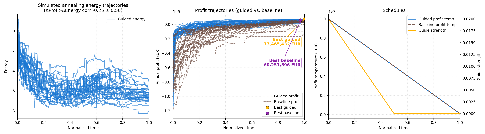
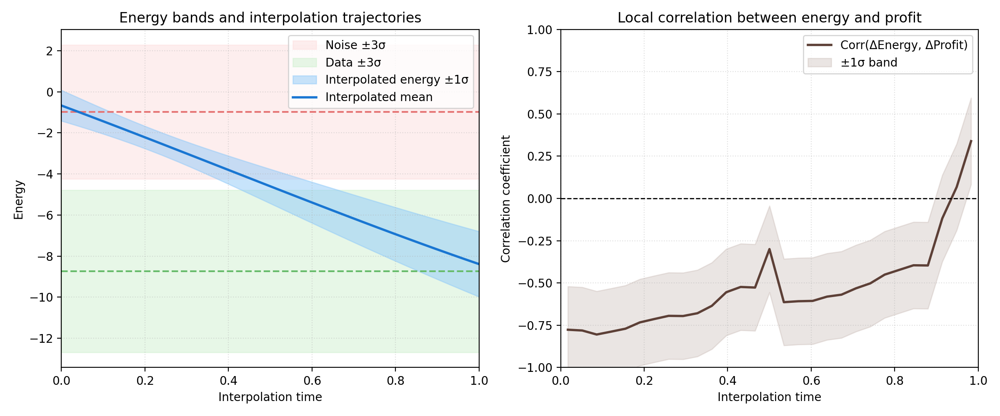

# Simulated Annealing & Energy-Matching Solvers

The repository ships two related samplers:

1. A **profit-only simulated annealing baseline** (`run_simulated_annealing_simple.py`) that never touches the energy network. It is ideal for debugging temperature schedules because it only relies on the profit oracle.
2. An **energy-guided sampler** (and comparison utilities) that combine the learned energy model with profit-based acceptance.

The sections below walk through both flavors.

## Profit-Only Baseline

Features of `run_simulated_annealing_simple.py`:

- Random initialization: every chain begins from the uniform prior over reactor, storage, SOC, and production variables (stored as fractions of their implied capacities, not absolute MW/MWh).
- Mixed proposals: Gaussian jitter on continuous trajectories combined with local (±2) flips of the discrete reactor/storage selections.
- Physical feasibility: production and SOC stay in [0,1] in solver space and are only expanded back to MW/MWh using the current configuration when computing profit/energy, so the sampler never explores impossible combinations.
- Temperature schedules: choose between `constant` and `linear` for the profit temperature.

### Usage examples

Linear temperature schedule:

```bash
python run_simulated_annealing_simple.py \
  --num-chains 32 --steps 10000 --total-time 1.0 \
  --cont-temp 0.05 --profit-temp 1e7 \
  --temp-schedule linear --seed 123
```

Constant temperature schedule:

```bash
python run_simulated_annealing_simple.py \
  --num-chains 32 --steps 10000 --total-time 1.0 \
  --cont-temp 0.05 --profit-temp 1e7 \
  --temp-schedule constant --seed 123
```

Running this script produces the baseline plots shown below.


## Energy-Matching Guided Sampler

The guided sampler uses a learned energy model to steer proposals (continuous moves use a gradient drift; discrete moves mix random flips with discrete Langevin steps). The solver still accepts/rejects based on profit, but we can bias proposals toward high-energy regions and anneal both the profit temperature and the guidance strength.

### Training the energy network (64-64-64 MLP)

1. **Warmup flow-matching stage** – trains the energy network purely with the FM loss:

   ```bash
   python train_energy_matching.py \
     --data-path positive_samples.json \
     --batch-size 128 --epochs 10 \
     --hidden-sizes 64 64 64 --lr 1e-4 --weight-decay 1e-4 \
     --checkpoint-dir energy_checkpoints/warmup \
     --log-path energy_training_log.json
   ```

2. **Main FM + CD stage** – resumes from the warmup checkpoint and learns negatives using the solver:

   ```bash
   python train_energy_matching_main.py \
     --data-path positive_samples.json \
     --resume energy_checkpoints/warmup/energy_model_epoch_10.pt \
     --batch-size 64 --epochs 5 \
     --lambda-fm 1.0 --lambda-cd 1.0 \
     --cd-delta-t 0.01 --cd-total-time 2.0 --cd-beta 5.0 --cd-lambda 2.0 \
     --hidden-sizes 64 64 64 --lr 1e-4 --weight-decay 1e-4 \
     --checkpoint-path energy_checkpoints/main_training_final.pt \
     --loss-plot figures/main_training_losses.png \
     --log-path energy_training_main_log.json
   ```

The resulting checkpoint (`energy_checkpoints/main_training_final.pt`) feeds all guided sampling experiments below.

### Guided SA (single run)

Use `run_simulated_annealing.py` to inspect trajectories from the guided sampler. Both the profit temperature and guide strength can follow `constant` or `linear` schedules (default linear decay to 1% and 20% of the initial values, respectively), and the output plot now displays the two schedules in a third panel.

```bash
python run_simulated_annealing.py \
  --checkpoint energy_checkpoints/main_training_final.pt \
  --data-path positive_samples.json \
  --num-data 8 --num-noise 8 \
  --steps 500 --total-time 1.0 \
  --cont-temp 0.05 --profit-temp 1e7 \
  --profit-schedule linear --profit-final-ratio 0.01 \
  --guide-strength 0.02 --guide-schedule linear --guide-final-ratio 0.2 \
  --hidden-sizes 64 64 64 \
  --output figures/solver_simulated_annealing.png
```

Important flags:

- `--proposal-mode`: `guided` (default) uses the energy gradient; `random` reproduces the baseline mixed proposals.
- `--profit-schedule`, `--profit-final-ratio`: shape the MH temperature schedule.
- `--guide-schedule`, `--guide-final-ratio`: independently anneal the guidance strength so it can fade out later in the trajectory.

### Guided vs. baseline overlay

`run_simulated_annealing_with_baseline.py` runs both proposal modes (noise-only initialization) and overlays them in a single figure: energy trajectories with the Δprofit–Δenergy correlation, profit trajectories with highlighted best chains, and a shared schedule panel (profit temperature on the left axis, guide strength on the right).

```bash
python run_simulated_annealing_with_baseline.py \
  --checkpoint energy_checkpoints/main_training_final.pt \
  --data-path positive_samples.json \
  --num-chains 32 --steps 500 --total-time 1.0 \
  --cont-temp 0.05 --profit-temp 1e7 \
  --guide-strength 0.02 --guide-prob 0.7 \
  --profit-schedule linear --profit-final-ratio 0.01 \
  --guide-schedule linear --guide-final-ratio 1.0 \
  --hidden-sizes 64 64 64 \
  --output figures/solver_simulated_annealing_with_baseline.png
```

The script prints both acceptance rates so you can compare how strongly annealing the guide affects mixing relative to the random baseline.



To replicate the energy-band diagnostic from training for the same checkpoint:

```bash
python run_energy_bands.py \
  --checkpoint energy_checkpoints/main_training_final.pt \
  --data-path positive_samples.json \
  --hidden-sizes 64 64 64 \
  --num-paths 12 --num-grid 30 \
  --output figures/energy_bands.png
```


