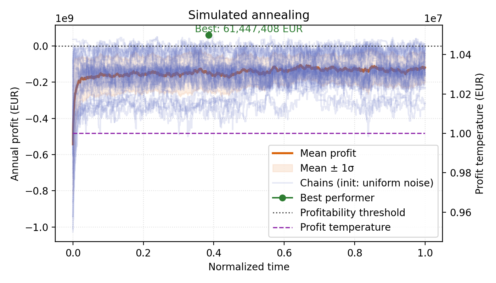
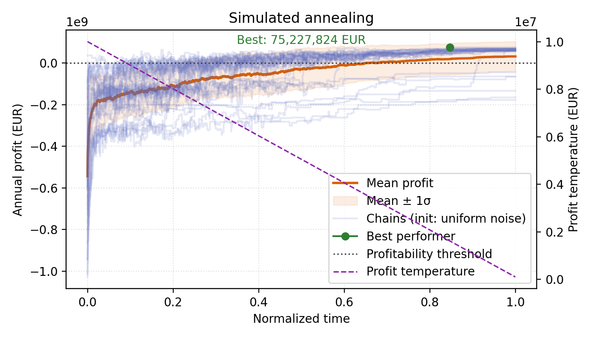

# Simulated Annealing Sampler (Profit-Only)

This folder includes a lightweight simulated annealing driver (`run_simulated_annealing_simple.py`) that samples SMR configurations without relying on the learned energy model. It generates trajectories directly from random initial conditions and accepts/rejects moves purely based on annual profit.

## Features

- Random initialization: every chain begins from the uniform prior over reactor, storage, SOC, and production variables (stored as fractions of their maximum capacity).
+ Mixed proposals: Gaussian jitter on continuous trajectories combined with local (±2) flips of the discrete reactor/storage selections.
- Physical feasibility: production and SOC are stored as fractions and converted to real capacities (based on the current discrete selections) at evaluation time, so the sampler never explores impossible configurations.
- Temperature schedules:
  - `constant`: keeps the profit temperature fixed.
  - `linear`: linearly cools the profit temperature from the initial value down to 1% of that value.
- Profit-only diagnostics: the output plot shows individual profit trajectories, the mean ±1σ band, profitability threshold, and the selected temperature schedule on a secondary axis.
- No dependency on `energy_checkpoints` or the energy-based solver.

## Usage

Run the sampler with the explicit hyperparameters you want to document:

```bash
python run_simulated_annealing_simple.py \
  --num-chains 32 --steps 10000 --total-time 1.0 \
  --cont-temp 0.05 --profit-temp 1e7 \
  --temp-schedule linear --seed 123
```

Constant temperature example:

```bash
python run_simulated_annealing_simple.py \
  --num-chains 32 --steps 10000 --total-time 1.0 \
  --cont-temp 0.05 --profit-temp 1e7 \
  --temp-schedule constant --seed 123
```

Omitting `--output` automatically writes to `figures/solver_simulated_annealing_temp_<schedule>.png`. The script prints the MH acceptance rate so you can compare temperature settings.





### Parameters

- `--num-chains`: total number of SA chains (uniform prior for all).
- `--steps`, `--total-time`: number of MH steps and normalized time horizon for plotting.
- `--cont-temp`: standard deviation of the Gaussian jitter applied to continuous trajectories.
- `--profit-temp`: initial profit temperature (in EUR).
- `--temp-schedule`: `constant` or `linear`.
- `--seed`: random seed to reproduce the same initialization and proposals.

This setup is meant as a quick baseline to compare profit trajectories under fully random proposals against any other heuristic or optimizer. It makes no use of the energy network or the original SA-MCMC implementation.
